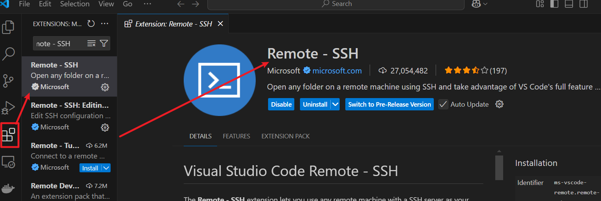
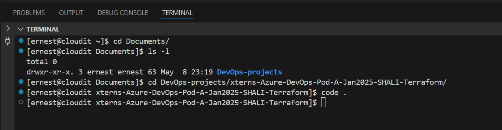

# Setting Up Remote Development: SSH into a Linux VM from Windows Using VS Code

## Introduction

In modern development workflows, working across multiple environments like developing on a Linux server while using a Windows machine is common. This guide documents how I configured my development environment to **securely SSH into a Linux virtual machine (VM) from a Windows host** and edit my project files using **Visual Studio Code (VS Code)** with the `Remote - SSH extension`.

Whether you're working on web development, DevOps projects, or learning Linux, this setup ensures a clean separation of environments, flexibility, and the power of remote coding.

### Benefits of This Setup

- Develop directly on a Linux environment without dual-booting or switching OS.
- Use the full features of VS Code as if you're coding locally.
- Maintain clean and isolated dev environments
- Great for learning Linux, SSH, or preparing for DevOps workflows.
- Works seamlessly with VirtualBox, WSL, or even remote cloud servers.

## Environment

- **Host:** Windows 11
- **Guest VM:** CentOS 9 Stream (VirtualBox)
- **Editor:** Visual Studio Code with Remote - SSH extension

### Step 1: Install and Configure `OpenSSH` on `Linux`

**Purpose:** Enables your `Linux VM` to accept **SSH connections** from external systems.

```bash
sudo apt update
sudo apt install openssh-server
sudo systemctl enable ssh
sudo systemctl start ssh
```

### To verify:

```bash
which sshd
sudo systemctl status ssh
```


### Step 2: Change VM Network to Bridged Adapter in VirtualBox

**Purpose:** Allows your `VM` to be on **the same network** as your `host machine`, making it reachable via `IP address`.

- Open **VirtualBox > Settings > Network**
- Set **Adapter 1** to **Bridged Adapter**
- Choose your host's active network (Wi-Fi or Ethernet)

    

- Start the VM and run:
  
  ```bash
  ip a
  ```
  **to get the Linux machine’s IP address.**

    

- Note the **Linux VM** `IP address` (e.g., `192.168.0.146`)

### Step 3: SSH from Windows `PowerShell`

**Purpose:** Confirms you can securely access the Linux VM from Windows via terminal.

```bash
ssh username@<linux-ip>
```

Example:

```bash
ssh ernest@192.168.0.146 OR ssh ubuntu@192.168.1.100
```


### Step 4: Use `VS Code Remote - SSH`

**Purpose:** Set up VS Code to access and edit files on the Linux VM as if they were local.

- Install the **Remote - SSH** extension in VS Code
  
  

- Open the SSH config file via:

    ```bash
    Ctrl+Shift+P > Remote-SSH: Open SSH Configuration File
    ```

- Add your host:

    ```bash
    Host my-linux-vm
        HostName 192.168.1.100
        User ubuntu
        Port 22
    ```

    

    

    

### Step 5: Connect and Code!

**Purpose:** Connect to your Linux VM from VS Code and begin coding remotely with full feature support.

Run:

    ```bash
    Ctrl+Shift+P > Remote-SSH: Connect to Host > 192.168.0.146
    ```


- Navigate to project folder:

    

    

    

And just like that, I’m editing files on my **Linux VM**from my **Windows machine** using the full power of `VS Code`.

## This setup is ideal for:

- Working on Linux environments from Windows
- Learning DevOps or web development with Ubuntu
- Keeping host and development environments clean and separate